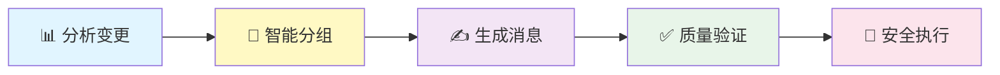

<div align="center">

# 🎯 CommitCraft

### 智能化 Git 提交工作流系统

*让每一次提交都成为艺术品*

[](https://opensource.org/licenses/MIT)
[](http://makeapullrequest.com)
[](https://github.com/zengwenliang416/CommitCraft)

[English](README.md) | [简体中文](docs/README.zh-CN.md)

</div>

---

## ✨ 为什么选择 CommitCraft?

> 厌倦了写糟糕的提交消息? 担心不小心提交敏感信息? CommitCraft 通过 **5 个智能体协作流水线**,自动分析、分组、生成、验证并执行专业级的 git 提交。

### 🎁 核心亮点

<table>
<tr>
<td width="50%">

#### 🤖 **智能自动化**
- 5 个专业 AI 智能体协作
- 自动分析变更和依赖关系
- 智能分组文件为逻辑单元
- 生成符合规范的提交消息

</td>
<td width="50%">

#### 🛡️ **质量保证**
- 90/100 分最低质量要求
- 4 维度验证系统
- 自动安全检查(API 密钥/密码)
- 阻止包含敏感数据的提交

</td>
</tr>
<tr>
<td width="50%">

#### 📚 **完整文档**
- 每次提交都有完整记录
- Markdown + JSON 双格式
- 可追溯的会话历史
- 自动生成摘要报告

</td>
<td width="50%">

#### 🌍 **开发者友好**
- 🇬🇧 英文 / 🇨🇳 中文双语支持
- 交互式确认流程
- 分支策略灵活选择
- 一键安装,即插即用

</td>
</tr>
</table>

---

## 🚀 快速开始

### 📦 安装

```bash
# 克隆仓库
git clone https://github.com/zengwenliang416/CommitCraft.git
cd CommitCraft

# 交互式安装(推荐)
./Install-Claude.sh

# 或者非交互式安装到当前项目
./Install-Claude.sh -InstallMode Path -TargetPath /your/project -NonInteractive
```

### ⚡ 使用

```bash
# 🎯 基础使用 - 完整的交互式流程
/commit-pilot

# 🚄 快速模式 - 跳过确认,使用智能默认值
/commit-pilot --quick

# 👀 预览模式 - 查看结果但不实际提交
/commit-pilot --preview

# 🌏 中文提交消息
/commit-pilot --language ch

# 📦 批量处理 - 为多个功能创建独立提交
/commit-pilot --batch
```

### 🎬 工作流程演示



---

## 🎨 核心功能

### 🤖 五大智能体流水线

<details>
<summary><b>1️⃣ commit-analyzer</b> - 变更分析专家</summary>

**职责**: 深度分析代码仓库变更

- ✅ 检测 git 状态和差异
- ✅ 按类型分类变更(代码/文档/配置/资源)
- ✅ 使用 MCP code-index 识别功能和模块
- ✅ 映射文件依赖关系
- ✅ 计算变更复杂度和风险

**输出**: `00-repository-analysis.md` + JSON

</details>

<details>
<summary><b>2️⃣ commit-grouper</b> - 智能分组专家</summary>

**职责**: 将文件组织为逻辑提交单元

- ✅ 按功能/模块智能分组
- ✅ 尊重文件依赖关系
- ✅ 应用分组规则(每组最多 10 个文件)
- ✅ 生成可执行的 git add 命令
- ✅ 交互式确认分组策略

**输出**: `01-grouping-strategy.md` + JSON

</details>

<details>
<summary><b>3️⃣ commit-message</b> - 消息生成专家</summary>

**职责**: 生成专业的提交消息

- ✅ 符合 [Conventional Commits](https://www.conventionalcommits.org/) 规范
- ✅ 支持 11 种类型: `feat|fix|docs|style|refactor|test|chore|perf|ci|build|revert`
- ✅ 使用祈使语气,主题 ≤72 字符
- ✅ 提供详细的正文和 footer 说明
- ✅ 🇬🇧 英文 / 🇨🇳 中文双语支持

**输出**: `02-commit-messages.md` + JSON

</details>

<details>
<summary><b>4️⃣ commit-validator</b> - 质量验证专家</summary>

**职责**: 多维度质量和安全验证

**质量验证** (4 个维度,各 25 分):
- ✅ **格式合规性**: 符合 Conventional Commits
- ✅ **清晰度**: 描述清晰、具体、无歧义
- ✅ **完整性**: 解释所有变更和影响
- ✅ **约定遵守**: 行长度、footer 格式等

**安全检查** (阻断性):
- 🔒 API 密钥、访问令牌
- 🔒 密码和凭证
- 🔒 AWS/云服务凭证
- 🔒 私钥和证书
- 🔒 数据库连接字符串

**最低标准**: 总分 ≥ 90/100,无严重安全问题

**输出**: `03-validation-report.md` + JSON

</details>

<details>
<summary><b>5️⃣ commit-executor</b> - 安全执行专家</summary>

**职责**: 安全可靠地执行 git 提交

- ✅ 验证验证状态为"已批准"
- ✅ 创建自动备份分支
- ✅ 灵活的分支策略(feature 分支/当前分支)
- ✅ 安全执行 git 提交
- ✅ 处理 pre-commit hook 修改
- ✅ 失败时自动回滚

**输出**: `04-execution-log.md` + JSON

</details>

---

## 📂 项目结构

```
CommitCraft/
├── 📁 .claude/                        # 核心组件(会被安装)
│   ├── 🤖 agents/                    # 5 个智能体
│   │   ├── commit-analyzer.md        # 分析专家
│   │   ├── commit-grouper.md         # 分组专家
│   │   ├── commit-message.md         # 消息生成专家
│   │   ├── commit-validator.md       # 验证专家
│   │   └── commit-executor.md        # 执行专家
│   ├── 📋 commands/
│   │   └── commit-pilot.md           # 主编排命令
│   ├── 📝 workflows/cli-templates/   # Prompt 模板
│   │   └── prompts/commitcraft/
│   │       ├── conventional-commits.txt      # 提交规范
│   │       ├── quality-criteria.txt          # 质量标准
│   │       └── security-patterns.txt         # 安全模式
│   └── 🎨 output-styles/
│       └── commitcraft-workflow.md   # 输出格式
├── 📚 docs/                          # 文档(不会被安装)
│   ├── architecture/                 # 架构设计
│   └── development-notes/            # 开发笔记
├── 📜 CLAUDE.md                      # 开发准则
├── 📖 README.md                      # 本文件
├── 🔧 Install-Claude.sh              # Shell 安装脚本
├── 🔧 Install-Claude.ps1             # PowerShell 安装脚本
└── 📄 LICENSE                        # MIT 许可证
```

---

## 📊 会话文档

每次执行都会创建完整的可追溯文档:

```
.claude/commitcraft/commitcraft-20250130-143522/
├── 📊 00-repository-analysis.md      # 变更内容分析
├── 📁 01-grouping-strategy.md        # 分组策略 + git add 命令
├── ✍️ 02-commit-messages.md          # 提交消息 + git commit 命令
├── ✅ 03-validation-report.md        # 质量评分和安全检查
├── 🚀 04-execution-log.md            # 执行结果和状态
├── 📝 05-session-summary.md          # 总体摘要(自动生成)
├── 📂 data/                          # 结构化数据
│   ├── repository-analysis.json
│   ├── grouping-strategy.json
│   ├── commit-messages.json
│   ├── validation-report.json
│   └── execution-log.json
└── summary.json                      # 会话元数据
```

---

## 🎛️ 命令选项

| 选项 | 说明 | 使用场景 |
|------|------|---------|
| `--batch` | 批量模式 | 多个独立功能分别提交 |
| `--quick` | 快速模式 | 跳过交互确认,使用智能默认值 |
| `--preview` | 预览模式 | 查看结果但不实际提交 |
| `--skip-validation` | 跳过验证 | ⚠️ 不推荐,仅调试使用 |
| `--skip-docs` | 跳过文档 | 不生成会话文档 |
| `--language <en\|ch>` | 指定语言 | 强制使用英文或中文消息 |

---

## 🛡️ 安全特性

CommitCraft 内置安全检查系统,自动检测并**阻止**包含以下敏感信息的提交:

<table>
<tr>
<td width="50%">

### 🔴 严重级别(阻断提交)
- 🔑 API 密钥和访问令牌
- 🔒 密码和凭证
- ☁️ AWS/云服务凭证
- 🔐 私钥和证书
- 🗄️ 数据库连接字符串

</td>
<td width="50%">

### 🟡 高级别(警告)
- 🎫 Bearer 令牌
- 🔗 OAuth 密钥
- 📱 JWT 令牌
- 🍪 会话 ID

</td>
</tr>
</table>

**检测到敏感数据时**:
1. ❌ 自动阻止提交执行
2. 📋 显示具体问题和位置
3. 💡 提供详细的修复建议
4. 🔧 引导使用环境变量等最佳实践

---

## 📈 质量标准

### 评分系统 (总分 100 分)

| 维度 | 分值 | 评估内容 |
|------|------|---------|
| **格式合规性** | 25 分 | Conventional Commits 格式 |
| **清晰度** | 25 分 | 描述清晰、具体、无歧义 |
| **完整性** | 25 分 | 解释所有变更和影响 |
| **约定遵守** | 25 分 | 行长度、footer 格式等 |

### ✅ 通过标准

- ✔️ **总分 ≥ 90/100**
- ✔️ **无严重安全问题**
- ✔️ 符合 Conventional Commits
- ✔️ 主题行 ≤72 字符
- ✔️ 使用祈使语气

### ❌ 验证失败时

系统会提供三个选项:
1. 🔄 **重新生成消息**(推荐) - 使用更严格的质量标准
2. ⚠️ **继续执行** - 不推荐,可能影响提交历史质量
3. 🛑 **取消操作** - 手动修改后重试

---

## 💡 最佳实践

<table>
<tr>
<td width="33%">

### 🎯 使用建议
- ✅ 使用 `/commit-pilot` 替代手动提交
- ✅ 提交前审查分析结果
- ✅ 信任质量验证系统
- ✅ 使用 `--preview` 预览结果

</td>
<td width="33%">

### 🚀 效率提升
- ⚡ 使用 `--quick` 加速流程
- 📦 使用 `--batch` 处理多功能
- 🌏 设置默认语言偏好
- 📝 查看会话文档学习

</td>
<td width="33%">

### 🛡️ 安全守则
- 🔒 永远不要跳过安全检查
- 📁 使用 `.env` 文件存储密钥
- 🔑 使用环境变量
- 🔍 定期审查会话文档

</td>
</tr>
</table>

---

## 🔧 技术栈

- **AI 框架**: Claude Code + Multi-Agent 协作
- **MCP 工具**: code-index, sequential-thinking
- **Git 集成**: 原生 git 命令
- **文档格式**: Markdown + JSON
- **语言支持**: Shell + PowerShell
- **平台支持**: macOS, Linux, Windows

---

## 📖 文档

- 📚 [完整文档](docs/README.md)
- 🏗️ [架构设计](docs/architecture/commitcraft-architecture.md)
- 🔄 [工作流实现](docs/architecture/COMMITCRAFT_WORKFLOW_IMPLEMENTATION.md)
- 🌿 [分支策略](docs/architecture/COMMITCRAFT_BRANCH_STRATEGY.md)
- 🧪 [测试指南](COMMITCRAFT-TESTING.md)
- 💻 [开发笔记](docs/development-notes/)

---

## 🤝 贡献

欢迎贡献! 请查看 [CLAUDE.md](CLAUDE.md) 了解开发准则。

### 贡献方式

1. 🍴 Fork 本仓库
2. 🌿 创建特性分支 (`git checkout -b feature/AmazingFeature`)
3. ✍️ 使用 CommitCraft 提交变更 (`/commit-pilot`)
4. 📤 推送到分支 (`git push origin feature/AmazingFeature`)
5. 🎉 创建 Pull Request

---

## 📄 许可证

本项目采用 MIT 许可证 - 查看 [LICENSE](LICENSE) 文件了解详情

---

## 🌟 Star History

如果这个项目对你有帮助,请给它一个 ⭐️!

[](https://star-history.com/#zengwenliang416/CommitCraft&Date)

---

<div align="center">

### 🎯 让每一次提交都成为艺术品

**由 [Claude Code](https://claude.com/claude-code) 驱动的智能工作流系统**

[⬆ 回到顶部](#-commitcraft)

</div>
