# 🚀 CommitCraft - 智能 Git 提交多智能体系统

<div align="center">

[]()
[]()
[]()
[]()

**将你的 Git 工作流从手动提交转变为智能编排，质量保证达 95%**

[🇬🇧 English](../README.md) | [🧰 命令参考](../commands/) | [🧠 智能体文档](../agents/) | [🗒 版本记录](../CHANGELOG-v3.md)

</div>

---

## 🎯 为什么选择 CommitCraft？

> **"一条命令，从混乱的提交到专业精准"**

传统 Git 工作流的痛点：
- 😩 团队间提交消息不一致
- 🎯 提交范围和组织混乱
- 📝 缺少上下文和文档
- 🔀 单个提交混合多个功能
- ⚠️ 暴露凭据的安全风险

**CommitCraft 的解决方案：**
- ✅ **95% 质量保证** - 每个提交都符合专业标准
- 🤖 **5 个专家 AI 智能体** - 专业分析、分组、生成、验证、执行
- 🚀 **一键工作流** - `/commit-pilot` 编排一切
- 📚 **完整过程文档** - 自动生成执行追踪文档
- 🔒 **安全优先** - 内置凭据检测和危险操作拦截
- 🌍 **真正跨平台** - 原生支持 Windows、macOS、Linux
- 🧹 **自动清理提交** - 自动移除 Claude Code 生成标记

## 🌟 革命性功能

### 🎭 多智能体编排

```mermaid
graph LR
    A[你的变更] --> B[分析智能体]
    B --> C[分组智能体]
    C --> D[消息智能体]
    D --> E[验证智能体]
    E --> F[执行智能体]
    F --> G[完美提交]
```



### 🎯 智能工作流

#### 1️⃣ **智能提交导航** - 完全自动化 + 文档追踪
```bash
/commit-pilot
# → 分析所有变更
# → 按功能分组
# → 生成消息
# → 验证质量（90+ 分）
# → 执行提交
# → 生成完整执行文档 (.claude/commitcraft/session-*)
```

#### 2️⃣ **批量处理** - 多功能，独立提交
```bash
/batch-commit
# → 检测多个功能
# → 创建独立提交
# → 维护依赖关系
# → 每个提交都有文档记录
```

#### 3️⃣ **历史学习** - 从过去改进
```bash
/commit-history --score
# → 分析过去提交
# → 识别模式
# → 提供改进建议
```

#### 4️⃣ **过程文档** - 完整追踪（新功能！）
```bash
# 每次执行自动生成文档
.claude/commitcraft/
└── commitcraft-20240117-143025/
    ├── 00-repository-analysis.md   # 仓库分析
    ├── 01-grouping-strategy.md     # 分组策略
    ├── 02-commit-messages.md       # 生成的消息
    ├── 03-validation-report.md     # 质量验证
    ├── 04-execution-log.md         # 执行日志
    └── summary.json                # 会话摘要
```

## ⚡ 快速开始

### 📦 安装（30 秒）
前置条件：
- Git 2.30+（必需）
- Node.js 16+（推荐用于 Hooks；核心功能不依赖）
- macOS/Linux 终端，或 Windows 通过 WSL/Git Bash

<details>
<summary><b>🍎 macOS / 🐧 Linux</b></summary>

```bash
# 标准安装
make install

# 开发模式（使用符号链接便于开发）
make dev

# 卸载
make uninstall

# 查看所有可用命令
make help
```
</details>

<details>
<summary><b>🪟 Windows</b></summary>

```bash
# 选项 1：使用 WSL（Windows Subsystem for Linux）- 推荐
wsl --install  # 如果未安装 WSL
make install

# 选项 2：使用 Git Bash
make install

# 选项 3：手动安装（进阶）
# 将文件复制到 Claude Code 目录：
#  - Agents  →  ~/.claude/agents/
#  - Commands → ~/.claude/commands/
#  - Hooks    → ~/.claude/hooks/
# 然后创建 ~/.claude/hooks.json（或直接运行 make install）
```
</details>

### 🚀 你的第一个专业提交

```bash
# 1. 进行你的更改
code src/feature.js

# 2. 运行 CommitCraft
/commit-pilot

# 3. 见证魔法 ✨
```

**输出：**
```
📊 仓库分析完成
━━━━━━━━━━━━━━━━━━━━━━━━━━━
变更文件：5
检测功能：2
质量预测：94/100

继续编排？(Y/n)
```

### 🧰 常用命令速查
- `/commit-pilot` — 全流程编排。常用参数：`--quick`、`--preview`、`--batch`、`--skip-docs`、`--skip-validation`、`--language <en|ch>`
- `/validate "type(scope): subject"` — 对提交消息打分与校验。参数：`--strict`、`--fix`
- `/analyze` — 扫描仓库变更。参数：`--deep`、`--summary`、`--format <text|json|markdown>`
- `/group` — 按策略分组为逻辑提交。参数：`--strategy <feature|module|type>`、`--max-files <n>`、`--interactive`
- `/batch-commit` — 批量处理多个提交。参数：`--auto`、`--preview`、`--parallel <n>`
- `/commit-history` — 分析历史提交。参数：`--last <n>`、`--author <name>`、`--score`、`--export markdown`

更多细节见 commands/ 目录中的对应文档。

## 🏗️ 架构深度解析

### 🤖 五大专家智能体

| 智能体 | 角色 | 专长 |
|-------|------|------|
| 🔍 **commit-analyzer** | 仓库扫描器 | 变更检测、依赖映射、风险评估 |
| 📁 **commit-grouper** | 组织专家 | 功能分离、逻辑分组、耦合检测 |
| ✍️ **commit-message** | 消息工匠 | 专业消息、双语支持、约定合规 |
| ✅ **commit-validator** | 质量守护者 | 90+ 评分、安全检查、格式验证 |
| 🚀 **commit-executor** | 安全操作员 | 原子提交、回滚能力、验证 |

### 🔄 工作流管道

```
┌─────────────────────────────────────────────────────┐
│                  阶段 0：扫描                         │
│             全面的仓库分析                            │
└─────────────────────────┬───────────────────────────┘
                          ↓
┌─────────────────────────────────────────────────────┐
│                 阶段 1：分组                         │
│         按功能智能组织文件                            │
│                  [用户关卡 🚪]                        │
└─────────────────────────┬───────────────────────────┘
                          ↓
┌─────────────────────────────────────────────────────┐
│                阶段 2：生成                          │
│           专业消息创建                               │
│              质量关卡 (≥90) 🎯                       │
└─────────────────────────┬───────────────────────────┘
                          ↓
┌─────────────────────────────────────────────────────┐
│                阶段 3：执行                          │
│          安全提交与验证                              │
│               [最终关卡 🚪]                          │
└─────────────────────────┬───────────────────────────┘
                          ↓
                    ✅ 成功
```

## 📊 真实案例

### 示例 1：多功能开发
```bash
$ /commit-pilot --batch

🔄 批量提交进度
════════════════════════
✅ 基础设施设置         [分数：96]
⏳ 用户认证             [处理中...]
⌛ API 文档             [等待中]

当前：feat(auth): ✨ 实现 OAuth2 流程
[████████░░░░] 66% 完成
```

### 示例 2：质量验证
```bash
$ /validate "fix: bug"

📊 验证报告
━━━━━━━━━━━━━━━━━━━
格式：     15/25 ❌
清晰度：   10/25 ❌
安全性：   25/25 ✅
约定：     12/25 ❌
━━━━━━━━━━━━━━━━━━━
总分：     62/100

状态：失败 ❌

建议：
1. 添加具体范围：fix(auth): ...
2. 描述实际修复的错误
3. 考虑添加表情：🐛
```

## 🛡️ 安全特性

### 🔐 内置保护
- **凭据检测** - 拦截 API 密钥、密码、令牌
- **危险操作预防** - 禁止 `rm -rf`、强制推送保护
- **敏感文件守护** - 保护 .env、配置文件
- **提交前验证** - 每次提交前的安全扫描

### 🪝 跨平台钩子
```javascript
// 自动安全验证
hooks/pre-tool-use.js       → 命令验证 & Claude Code 标记清理
hooks/user-prompt-submit.js → 输入增强
```

### 🧹 Claude Code 集成
- **自动标记移除** - 移除 `🤖 Generated with [Claude Code]` 标记
- **清理协作者信息** - 过滤 `Co-Authored-By: Claude` 条目
- **透明操作** - 无需用户干预，自动运行
- **全局覆盖** - 适用于通过 Claude Code 进行的所有 git 提交

## 📈 质量指标

### 评分系统（0-100）
```
95-100：🏆 完美   - 立即发布
90-94： ✅ 优秀   - 小改进可选
80-89： ⚠️ 良好   - 建议改进
<80：   ❌ 失败   - 必须修复
```

### 评估维度
- **格式合规** - 类型、范围、表情使用
- **消息清晰度** - 描述性、具体性、语法
- **安全标准** - 无暴露密钥、安全操作
- **约定遵守** - 团队标准、一致性

## 🎨 自定义配置

### 提交类型与表情
```javascript
feat:     ✨ 新功能
fix:      🐛 错误修复
docs:     📝 文档
style:    💄 格式化
refactor: ♻️  代码重构
perf:     ⚡ 性能优化
test:     ✅ 测试
chore:    🔧 维护
build:    📦 构建系统
ci:       💚 CI/CD
```

### 语言支持
```bash
# 从仓库自动检测
/commit-pilot

# 强制语言
/commit-pilot --language en  # 英文
/commit-pilot --language ch  # 中文
```

## 📚 高级用法

### 🔄 工作流模式

<details>
<summary><b>交互模式（默认）</b></summary>

```bash
/commit-pilot
# → 逐步确认
# → 适合重要提交
# → 最大控制权
# → 生成完整文档
```
</details>

<details>
<summary><b>快速模式</b></summary>

```bash
/commit-pilot --quick
# → 智能默认值
# → 跳过确认
# → 快速工作流
# → 仍生成文档
```
</details>

<details>
<summary><b>预览模式</b></summary>

```bash
/commit-pilot --preview
# → 演练模式
# → 不实际提交
# → 安全测试
# → 生成预览文档
```
</details>

<details>
<summary><b>跳过文档模式</b></summary>

```bash
/commit-pilot --skip-docs
# → 跳过文档生成
# → 更快执行
# → 适合简单提交
```
</details>

<details>
<summary><b>跳过验证模式</b></summary>

```bash
/commit-pilot --skip-validation
# → 跳过质量验证
# → 直接执行提交
# → 不推荐使用
```
</details>

### 📊 历史分析
```bash
# 分析团队模式
/commit-history --last 100 --export markdown

# 个人改进
/commit-history --author me --score
```

### 📚 过程文档管理
```bash
# 查看最近的会话文档
ls -la .claude/commitcraft/

# 查看特定会话的文档
cat .claude/commitcraft/commitcraft-20240117-143025/summary.json

# 清理旧文档（保留最近10个会话）
find .claude/commitcraft -type d -name "commitcraft-*" | sort | head -n -10 | xargs rm -rf
```

## 🚦 集成

### 无缝对接：
- ✅ **Git 钩子** - Pre-commit、commit-msg 验证
- ✅ **CI/CD** - GitHub Actions、GitLab CI、Jenkins
- ✅ **问题跟踪** - 自动链接 (#123)
- ✅ **约定式提交** - 完全合规
- ✅ **GPG 签名** - 支持签名提交

## 📖 文档
仓库内快速参考：
- 📝 命令参考：../commands/
- 🔧 智能体说明：../agents/
- 🗒 版本记录：../CHANGELOG-v3.md
- 🇬🇧 English：../README.md

常用 Make 目标：
- `make install` — 安装命令/智能体/钩子到 `~/.claude`
- `make dev` — 开发模式下创建符号链接
- `make status` — 查看安装及版本状态
- `make uninstall` — 卸载所有组件

常见问题排查：
- 未安装 Node.js：Hooks 可选；建议从 nodejs.org 安装
- 命令不可见：执行 `make install` 后重启 Claude Code
- 权限报错：确保 `~/.claude` 可写且 hooks 具有可执行权限

已知限制：
- 不执行 git push；聚焦本地提交与安全
- 质量阈值基于约定式提交；可通过参数放宽

## 🤝 贡献

欢迎贡献！查看 [CONTRIBUTING.md](../CONTRIBUTING.md)

```bash
# PR 前运行质量检查
/validate
/commit-pilot --preview
```

## 📄 许可证

MIT 许可证 - 查看 [LICENSE](../LICENSE)

## 🙏 致谢

为 Claude Code 社区用心打造 ❤️

特别感谢：
- Anthropic Claude 团队提供的卓越平台
- 开源贡献者们
- 早期采用者和反馈提供者

## 📮 支持

- 🐛 **问题反馈**：[GitHub Issues](https://github.com/zengwenliang416/CommitCraft/issues)
- 💬 **讨论**：[GitHub Discussions](https://github.com/zengwenliang416/CommitCraft/discussions)
- 📧 **邮箱**：support@commitcraft.dev

---

## ❓ 常见问答（FAQ）
- 是否需要联网？不需要。所有逻辑在本地执行，Hooks 在本机运行。
- 会改写提交历史吗？不会。仅执行标准 `git commit`；可先预览/演练。
- 过程文档存放在哪里？项目目录下 `.claude/commitcraft/commitcraft-<timestamp>/`。
- 可否跳过文档？可以：`/commit-pilot --skip-docs`，详见 commands/commit-pilot.md。
- 如何快速校验消息？运行 `/validate "type(scope): subject"`。

<div align="center">

### 🌟 在 GitHub 上给我们 Star！

**CommitCraft** - 每个提交都讲述完美的故事

`版本 3.0.0` | `MIT 许可证` | `为 Claude Code 打造`

</div>
