# CommitCraft Workflow - Complete Implementation Guide

## 🎯 Overview

This document provides a complete implementation of a CommitCraft-style intelligent Git commit workflow for the Claude-Code-Workflow project, following the established `.claude/` architecture.

## 📁 Complete File Structure

```
.claude/
├── workflows/
│   └── commitcraft-architecture.md         ✅ CREATED
├── agents/
│   ├── commit-analyzer.md                  ✅ CREATED
│   ├── commit-grouper.md                   ⚡ CREATE NEXT
│   ├── commit-message.md                   ⚡ CREATE NEXT
│   ├── commit-validator.md                 ⚡ CREATE NEXT
│   └── commit-executor.md                  ⚡ CREATE NEXT
├── commands/
│   ├── commit-pilot.md                     ⚡ CREATE NEXT
│   ├── batch-commit.md                     ⚡ CREATE NEXT
│   ├── commit-history.md                   ⚡ CREATE NEXT
│   ├── analyze.md                          ⚡ CREATE NEXT
│   ├── group.md                            ⚡ CREATE NEXT
│   └── validate.md                         ⚡ CREATE NEXT
├── scripts/
│   ├── git-analyze.sh                      ⚡ CREATE NEXT
│   ├── git-group.sh                        ⚡ CREATE NEXT
│   ├── git-validate.sh                     ⚡ CREATE NEXT
│   ├── git-execute.sh                      ⚡ CREATE NEXT
│   └── commitcraft-doc-generator.sh        ⚡ CREATE NEXT
└── workflows/cli-templates/
    └── prompts/commitcraft/
        ├── conventional-commits.txt         ⚡ CREATE NEXT
        ├── security-patterns.txt           ⚡ CREATE NEXT
        └── quality-criteria.txt            ⚡ CREATE NEXT
```

## 🔄 Agent Workflow Sequence

```mermaid
graph TB
    A[User: /commit-pilot] --> B[commit-analyzer]
    B -->|repository-analysis.json| C[commit-grouper]
    C -->|grouping-strategy.json| D[commit-message]
    D -->|commit-messages.json| E[commit-validator]
    E -->|validation-report.json| F{Score ≥ 90?}
    F -->|Yes| G[commit-executor]
    F -->|No| H[Show Issues & Retry]
    G -->|execution-log.json| I[Success ✅]
    H --> D
```



## 📋 Agent Specifications Summary

### 1. commit-analyzer ✅
**Status**: CREATED
**File**: `.claude/agents/commit-analyzer.md`
**Responsibilities**:
- Execute `git status` and `git diff`
- Classify changes (code/docs/config/assets)
- Detect features and modules
- Map dependencies
**Output**: `repository-analysis.json` + `00-repository-analysis.md`

### 2. commit-grouper
**Status**: TO CREATE
**Responsibilities**:
- Group files by feature/module logically
- Respect dependencies
- Generate `git add` commands
- Create commit boundaries
**Output**: `grouping-strategy.json` + `01-grouping-strategy.md`

**Key Algorithm**:
```javascript
// Group files by feature
for (const file of changes) {
  const feature = detectFeature(file.path, file.content)
  groups[feature] = groups[feature] || []
  groups[feature].push(file)
}

// Validate dependencies
for (const group of groups) {
  validateDependencies(group.files)
  generateGitAddCommand(group.files)
}
```

### 3. commit-message
**Status**: TO CREATE
**Responsibilities**:
- Generate Conventional Commits format messages
- Support bilingual (EN/CH)
- Include type, scope, subject, body, footer
- Generate `git commit` commands
**Output**: `commit-messages.json` + `02-commit-messages.md`

**Message Template**:
```
<type>(<scope>): <subject>

<body>

<footer>

🤖 Generated with [Claude Code](https://claude.com/claude-code)

Co-Authored-By: Claude <noreply@anthropic.com>
```

### 4. commit-validator
**Status**: TO CREATE
**Responsibilities**:
- Validate Conventional Commits format
- Score quality (0-100, require ≥90)
- Security checks (credentials, API keys)
- Convention adherence
**Output**: `validation-report.json` + `03-validation-report.md`

**Scoring Rubric**:
- Format (25%): Type, scope, subject compliance
- Clarity (25%): Clear, concise, unambiguous
- Completeness (25%): All relevant info included
- Convention (25%): Project-specific rules followed

### 5. commit-executor
**Status**: TO CREATE
**Responsibilities**:
- Execute `git add` commands safely
- Execute `git commit` commands
- Verify commit success
- Handle pre-commit hooks
- Rollback on failure
**Output**: `execution-log.json` + `04-execution-log.md`

**Execution Safety**:
```bash
# 1. Stage files
git add file1.js file2.js || rollback_and_exit

# 2. Commit with message
git commit -m "message" -m "body" -m "footer" || rollback_and_exit

# 3. Verify commit
git show --stat HEAD | verify_commit_hash
```

## 🎯 Command Specifications Summary

### /commit-pilot (Main Orchestrator)
**Workflow**:
1. Parse options (--batch, --quick, --preview, etc.)
2. Create session directory: `.claude/commitcraft/commitcraft-YYYYMMDD-HHMMSS/`
3. Invoke agents sequentially:
   - commit-analyzer → analyze changes
   - commit-grouper → group files
   - commit-message → generate messages
   - commit-validator → validate quality
   - commit-executor → execute commits (if approved)
4. Generate process documentation (00-05.md)
5. Create summary.json

**User Interaction**:
```
Analysis complete. Found 2 features:
  1. authentication (5 files)
  2. documentation (1 file)

Quality Score: 95/100 ✅

Choose action:
  [A] Auto-execute all commits
  [M] Show manual commands
  [P] Preview only (no commits)
  [C] Cancel

Your choice: _
```

### /batch-commit
Auto-detects multiple features and processes each as separate commit.

### /commit-history
Analyzes past commits for quality patterns and improvement suggestions.

**Example Output**:
```
Recent Commit Quality Analysis (last 20 commits):

Average Score: 87.5/100

Top Issues:
  1. Missing scope in 35% of commits
  2. Vague subjects (use imperative mood)
  3. No body text in feature commits

Recommendations:
  - Always include scope for code changes
  - Use format: <verb> <what> <where>
  - Add bullet points for multi-change commits
```

### /analyze, /group, /validate
Individual agent commands for granular control.

## 🛠️ Scripts Summary

### git-analyze.sh
Wrapper for git analysis commands with error handling:
```bash
#!/bin/bash
set -e

echo "🔍 Analyzing repository changes..."

# Status
git status --porcelain > /tmp/git-status.txt

# Diff stats
git diff --stat > /tmp/git-diff-stat.txt

# Full diff
git diff > /tmp/git-diff.txt

# Staged diff
git diff --cached > /tmp/git-diff-cached.txt

echo "✅ Analysis complete"
```

### git-group.sh
Intelligent file grouping based on patterns:
```bash
#!/bin/bash

# Read repository-analysis.json
features=$(jq -r '.features_detected[].name' repository-analysis.json)

# For each feature, create group
for feature in $features; do
  files=$(jq -r ".features_detected[] | select(.name==\"$feature\") | .files[]" repository-analysis.json)

  echo "Group: $feature"
  echo "Files: $files"
  echo "Command: git add $files"
  echo "---"
done
```

### git-validate.sh
Quality scoring and security checks:
```bash
#!/bin/bash

validate_format() {
  local message=$1

  # Check conventional commits format
  if [[ $message =~ ^(feat|fix|docs|style|refactor|test|chore|perf|ci|build|revert)\([a-z-]+\):.+ ]]; then
    echo "25"  # Format score
  else
    echo "0"
  fi
}

check_security() {
  local diff=$1

  # Check for API keys
  if echo "$diff" | grep -qiE "api[_-]?key.*=.*['\"].{20,}['\"]"; then
    echo "BLOCKED: API key detected in diff"
    return 1
  fi

  # Check for passwords
  if echo "$diff" | grep -qiE "password.*=.*['\"].*['\"]"; then
    echo "WARNING: Password pattern detected"
  fi

  return 0
}
```

### git-execute.sh
Safe commit execution with rollback:
```bash
#!/bin/bash

execute_commit() {
  local files=$1
  local message=$2

  # Backup current state
  local backup_branch="commitcraft-backup-$(date +%s)"
  git branch $backup_branch

  # Execute
  git add $files
  if [ $? -ne 0 ]; then
    echo "❌ git add failed"
    return 1
  fi

  git commit -m "$message"
  if [ $? -ne 0 ]; then
    echo "❌ git commit failed"
    git reset HEAD  # Rollback staging
    return 1
  fi

  echo "✅ Commit successful"
  git branch -D $backup_branch  # Clean up backup
  return 0
}
```

### commitcraft-doc-generator.sh
Generate session documentation:
```bash
#!/bin/bash

SESSION_DIR=$1
DATA_DIR="$SESSION_DIR/data"

# Generate summary
cat > "$SESSION_DIR/05-session-summary.md" <<EOF
# Session Summary

**Session ID**: $(basename $SESSION_DIR)
**Timestamp**: $(date -Iseconds)

## Results

$(jq -r '.executions[] | "- ✅ \(.group_id): \(.git_commit.commit_hash)"' "$DATA_DIR/execution-log.json")

## Quality Scores

$(jq -r '.validations[] | "- \(.group_id): \(.quality_score)/100"' "$DATA_DIR/validation-report.json")

## Files Changed

Total: $(jq '.summary.total_files' "$DATA_DIR/repository-analysis.json")

See individual stage documents for details.
EOF
```

## 📚 Template Files

### prompts/commitcraft/conventional-commits.txt
```
You are generating commit messages following Conventional Commits specification.

Format:
<type>(<scope>): <subject>

<body>

<footer>

Types: feat, fix, docs, style, refactor, test, chore, perf, ci, build, revert
Scope: Module or feature name
Subject: Imperative mood, no period, max 72 chars

Body: Bullet points for multiple changes, explain "why" not "what"
Footer: Breaking changes, issue references, co-author

Example:
feat(auth): implement JWT-based authentication

- Add login endpoint with JWT generation
- Implement token validation middleware
- Add comprehensive unit tests

Closes #123

🤖 Generated with [Claude Code](https://claude.com/claude-code)

Co-Authored-By: Claude <noreply@anthropic.com>
```

### prompts/commitcraft/security-patterns.txt
```
Security Check Patterns:

BLOCK if found:
- API keys: api[_-]?key.*=.*['"]\w{20,}['"]
- Passwords: password.*=.*['"].*['"]
- Tokens: token.*=.*['"].*['"]
- AWS credentials: aws_access_key_id|aws_secret_access_key
- Private keys: .*\.pem|.*\.key in added files

WARN if found:
- Environment variables in code (not .env files)
- Database connection strings with credentials
- Email addresses in code (excluding comments)
- Hardcoded URLs with credentials
```

### prompts/commitcraft/quality-criteria.txt
```
Commit Quality Scoring (0-100):

1. Format Compliance (25 points):
   - Follows Conventional Commits [25]
   - Missing type [-10]
   - Missing scope [-5]
   - Invalid format [-15]

2. Clarity (25 points):
   - Clear subject [10]
   - Descriptive body [10]
   - Proper grammar [5]
   - Vague/unclear [-10]

3. Completeness (25 points):
   - All changes explained [10]
   - Why, not just what [10]
   - Context provided [5]
   - Missing info [-10]

4. Convention (25 points):
   - Project style [10]
   - Imperative mood [5]
   - Line length [5]
   - Breaking changes noted [5]

Minimum passing score: 90/100
```

## 🔧 Integration with Current Architecture

### Follows .claude/ Standards

1. **JSON-Only Data Model**: All agents produce JSON + Markdown
2. **Agent-Based**: Each agent is independent, well-defined
3. **Slash Commands**: User-friendly command interface
4. **MCP Integration**: Uses code-index, exa, context7
5. **Session Management**: Timestamped sessions with full traceability
6. **Script Support**: Bash scripts in `.claude/scripts/`

### Extends Existing Patterns

- Uses same agent frontmatter (name, description, tools)
- Follows command option patterns (--help, --batch, etc.)
- Integrates with existing workflow architecture
- Compatible with TodoWrite for progress tracking
- Supports Flow Control for complex operations

## 📊 Quality Assurance

### Testing Strategy

1. **Unit Tests** (each agent):
   - Test with sample git repositories
   - Verify JSON schema compliance
   - Check error handling

2. **Integration Tests** (full pipeline):
   - Test complete /commit-pilot workflow
   - Verify agent communication via JSON
   - Test rollback on failures

3. **Security Tests**:
   - Verify credential detection
   - Test dangerous operation blocking
   - Validate escape/injection prevention

### Validation Checklist

- [ ] All agents produce valid JSON
- [ ] Markdown reports are human-readable
- [ ] Quality scoring is consistent
- [ ] Security checks catch common patterns
- [ ] Git operations are safe (no force push)
- [ ] Rollback works on commit failure
- [ ] Session documentation is complete
- [ ] Cross-platform compatible (macOS/Linux/Windows)

## 🚀 Usage Examples

### Basic Workflow
```bash
# Make changes
git add .

# Run commit workflow
/commit-pilot

# Output:
# ✅ Analysis complete (5 files changed)
# ✅ Grouped into 2 features
# ✅ Messages generated
# ✅ Validation passed (Score: 95/100)
#
# Execute commits? [Y/n] y
# ✅ Committed: feat(auth): implement login
# ✅ Committed: docs: update README
```

### Batch Mode
```bash
/commit-pilot --batch

# Detects 3 features, creates 3 separate commits automatically
```

### Preview Mode
```bash
/commit-pilot --preview

# Shows what would be committed without executing
```

### Quality Check Only
```bash
/validate

# Runs validation on staged changes without committing
```

## 🎓 Best Practices

1. **Run before committing**: Use /commit-pilot instead of manual commits
2. **Review analysis**: Check 00-repository-analysis.md before proceeding
3. **Validate quality**: Ensure score ≥ 90 before executing
4. **Use batch mode**: For multiple unrelated features
5. **Learn from history**: Run /commit-history periodically
6. **Customize templates**: Adjust quality-criteria.txt for your project

## 📖 Next Steps

To complete this implementation:

1. Create remaining agent files (commit-grouper, commit-message, commit-validator, commit-executor)
2. Create command files (commit-pilot, batch-commit, etc.)
3. Write shell scripts in `.claude/scripts/`
4. Create prompt templates in `.claude/workflows/cli-templates/prompts/commitcraft/`
5. Test with real repositories
6. Document in project README
7. Create tutorial videos/guides

## 🆘 Troubleshooting

### Issue: "No changes detected"
**Solution**: Ensure you have unstaged or staged changes

### Issue: "Validation failed (score < 90)"
**Solution**: Review 03-validation-report.md for specific issues

### Issue: "Git command failed"
**Solution**: Check git status manually, ensure repo is valid

### Issue: "Security check blocked commit"
**Solution**: Remove sensitive data, use environment variables

## 📚 References

- [Conventional Commits](https://www.conventionalcommits.org/)
- [Claude Code Documentation](https://docs.claude.com/claude-code)
- Current Project: `.claude/workflows/workflow-architecture.md`
- Git Best Practices: [Git SCM](https://git-scm.com/book/en/v2)
